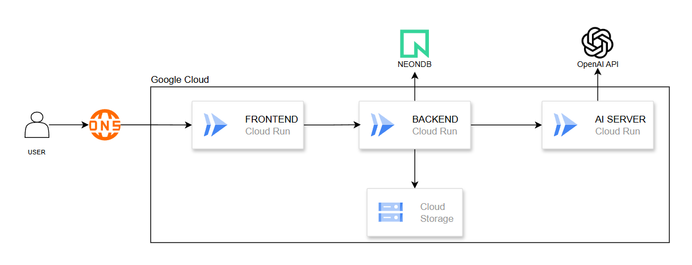

<p align="center">
  
</p>

# NYANG Backend

## 1. 프로젝트 개요
NYANG Backend는 AI 기반 학습 경험 개선을 위한 LMS 백엔드입니다.  
단순히 강의를 업로드하고 시청하는 기능에 머무르지 않고, 강의 영상의 STT 자막과 학습자의 시청 로그를 함께 활용해 더 나은 학습 경험을 제공하는 것을 목표로 합니다.

학습자에게는 퀴즈, 보충 설명, 복습 포인트를 제공하고, 강사에게는 실제로 학습자가 어려움을 겪는 구간과 개선이 필요한 지점을 전달할 수 있도록 설계했습니다.

---

## 2. 목표
- 강의 업로드, 조회, 삭제 등 LMS 핵심 기능 제공
- 영상 시청 로그를 수집하여 학습 행동 데이터 축적
- STT 서버 연동을 통한 자막 및 세그먼트 데이터 저장
- 강의 내용 요약 및 키워드 추출
- 강의 내용 기반 Pre Analysis 수행
- 실제 시청 패턴 기반 Aggregate Analysis 수행
- 학습자와 강사 모두에게 의미 있는 AI 기반 인사이트 제공

---

## 3. 기술 스택

### 3.1 Backend
- Java 21
- Spring Boot
- Spring Data JPA
- Spring Security
- Gradle

### 3.2 Database
- PostgreSQL
- NeonDB

### 3.3 Infra
- Docker
- Google Cloud Run
- Google Cloud Storage

---

## 4. Architecture

<p align="center">
  
</p>

NYANG Backend는 Frontend, Database, AI Analysis Server 사이에서 전체 흐름을 조율하는 중심 서버 역할을 담당합니다.  
Frontend의 요청을 받아 강의와 학습 데이터를 관리하고, 필요한 시점에 AI 서버와 연동해 분석 결과를 생성한 뒤 이를 Database에 저장하고 사용자에게 제공합니다.

Frontend  
↓  
Spring Boot Backend  
├── 강의 / 강좌 관리  
├── 영상 업로드 및 메타데이터 저장  
├── 시청 로그 수집 및 세션 집계  
├── 마지막 시청 위치 관리  
├── 분석 결과 조회  
├── Database 연동  
└── AI Analysis Server 연동  

Spring Boot Backend  
├─→ Database  
│   ├── 강의 정보 저장  
│   ├── 자막 / 세그먼트 저장  
│   ├── 시청 로그 및 세션 데이터 저장  
│   └── 분석 결과 저장  
│
└─→ AI Analysis Server  
    ├── 전체 자막 생성  
    ├── 세그먼트 생성  
    ├── Pre Analysis 수행  
    └── Aggregate Analysis 수행  

---

## 5. 실행 방법

### 5.1 환경 변수 설정
프로젝트 실행 전 `.env` 파일 또는 실행 환경 변수에 아래 값을 설정해야 합니다.

예시 `.env`
```env
DB_URL=jdbc:postgresql://localhost:5432/your_db
DB_USERNAME=your_username
DB_PASSWORD=your_password
DB_MODE=update
JWT_SECRET=your_jwt_secret_key
JWT_EXPIRATION=3600000
STT_SERVER_URL=http://localhost:8001
GCP_STORAGE_BUCKET=your_bucket_name
```
### 5.2 application.properties 설정
프로젝트에서는 아래와 같이 환경 변수를 참조합니다.
```properties
spring.datasource.url=${DB_URL}
spring.datasource.username=${DB_USERNAME}
spring.datasource.password=${DB_PASSWORD}
spring.datasource.driver-class-name=org.postgresql.Driver
spring.jpa.hibernate.ddl-auto=${DB_MODE}
spring.jpa.show-sql=false
spring.jpa.properties.hibernate.format_sql=false
jwt.secret=${JWT_SECRET}
jwt.access-expiration=${JWT_EXPIRATION}
stt.base-url=${STT_SERVER_URL}
ai.lecture.base-url=${STT_SERVER_URL}
gcp.storage.bucket=${GCP_STORAGE_BUCKET}
server.forward-headers-strategy=framework
server.http2.enabled=true
spring.servlet.multipart.max-file-size=500MB
spring.servlet.multipart.max-request-size=500MB
```
### 5.3 로컬 실행
로컬 개발 환경에서는 `.env` 파일을 작성한 뒤 `dev` 환경에서 실행하면 됩니다.

Mac / Linux
./gradlew bootRun

Windows
gradlew.bat bootRun

IDE를 사용하는 경우에도 `dev` 프로필로 실행하면 됩니다.

---

## 6. API 문서
Swagger를 통해 API 명세를 확인할 수 있습니다.

- Swagger UI: `http://localhost:8080/swagger-ui/index.html`

---

## 7. 한 줄 소개
강의를 제공하는 데서 끝나지 않고, 강의 내용과 실제 학습 행동 데이터를 함께 분석해 더 나은 학습 경험을 만드는 AI 기반 LMS 백엔드입니다.
